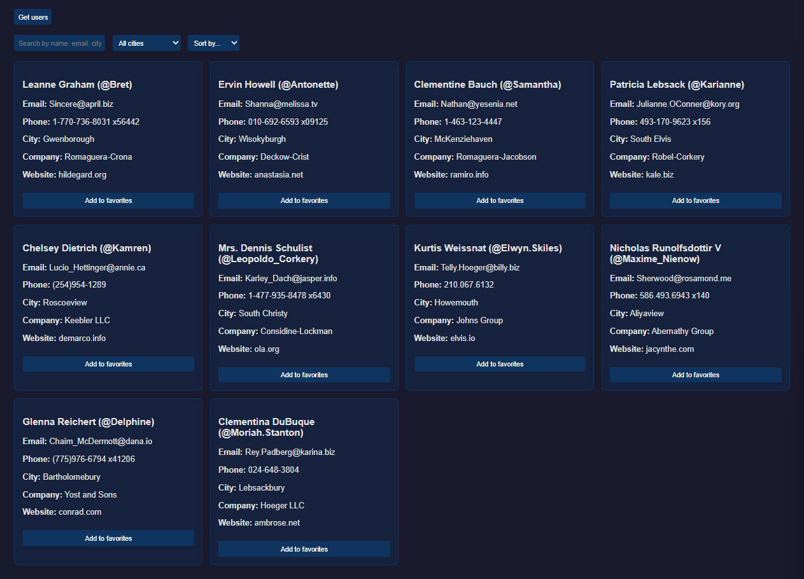
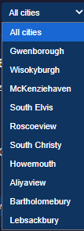
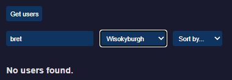
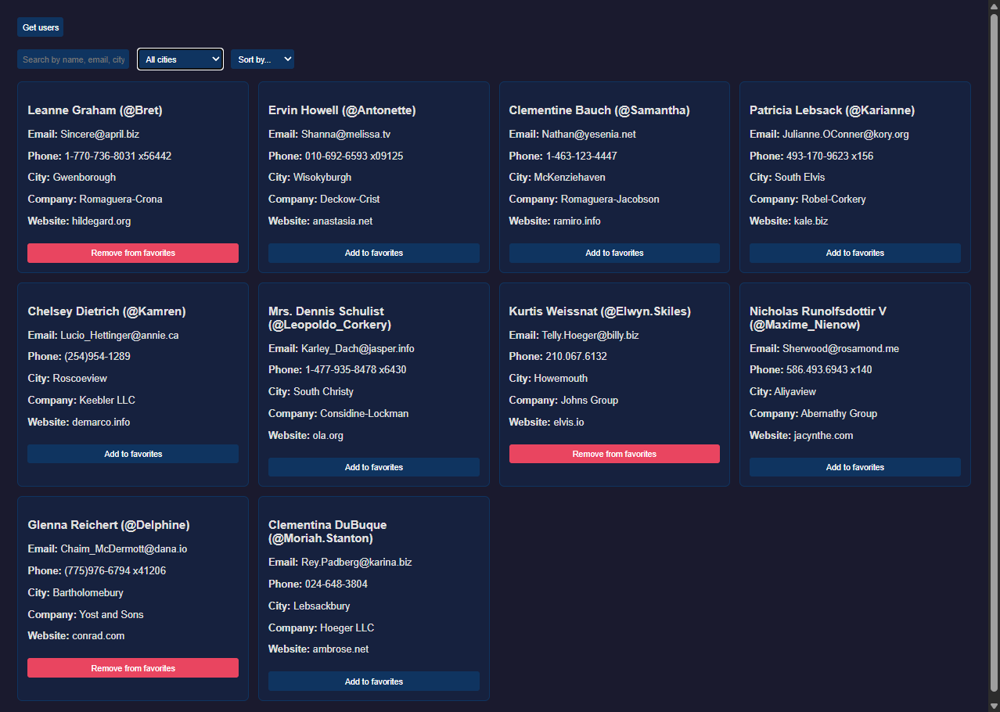

# Лабораторна робота 2: Пошук, фільтрація, сортування та збереження обраного у JavaScript

Цей проєкт створений у рамках другої лабораторної роботи. Основна мета — навчитися працювати з даними після їх завантаження з API: будувати повноцінну інтерактивну сторінку з пошуком у реальному часі, фільтрацією, сортуванням, оновленням DOM та збереженням стану за допомогою локального сховища.

## 🚀 Функціонал

- Отримання списку користувачів із зовнішнього API (`https://jsonplaceholder.typicode.com/users`) за допомогою `fetch()`.
- **Пошук у реальному часі:** фільтрація карток під час введення тексту (за іменем, username, email, містом та компанією).
- **Фільтрація за містом:** динамічне формування випадаючого списку міст на основі отриманих даних.
- **Сортування:** можливість сортування користувачів за іменем, username, містом або назвою компанії.
- **Обране (Favorites):** можливість додавати та видаляти користувачів з обраного. Дані зберігаються у `localStorage` і залишаються навіть після оновлення сторінки.
- **Empty-state:** відображення повідомлення "No users found.", якщо за вибраними критеріями пошуку чи фільтру нікого не знайдено.
- Наявність індикатора завантаження (**Loading...**) та обробка помилок запиту.

## 🛠 Технології

- **HTML5** — структура сторінки та елементів керування.
- **CSS3** — стилізація карток, кнопок стану "Обране" (active states) та сітки (Grid).
- **JavaScript (ES6+)** — асинхронний код (`async/await`, `fetch`), робота з DOM (створення елементів, обробка подій `click`, `input`, `change`) та робота з Web Storage API (`localStorage`).

## 📷 Скріншот роботи

**1. Початковий стан (після завантаження даних та появи елементів керування):**

**2. Динамічний фільтр міст (список міст згенеровано на основі даних API):**

**3. Комбінований пошук та Empty State (коли користувачів не знайдено):**

**4. Збереження стану (обрані користувачі залишаються виділеними після оновлення сторінки):**

---
**Виконав:** Юрчик Владислав Сергійович  
**Група:** 232/2он